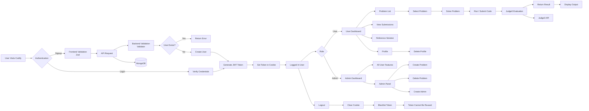

# 🚀<span>&lt;</span>CODIFY<span>/&gt;</span> 

Codify is a full-stack online coding platform where users can solve programming problems, run and submit code, track submissions, and access reference solutions.

Built using the MERN stack with Judge0 integration for secure code execution.

---

## ✨ Features

### 👨‍💻 User Features

- 🔐 Secure authentication system
- 📝 Signup and Login
- ✅ Frontend validation using Zod
- 🛡️ Backend validation and security checks
- 🍪 JWT authentication with cookie-based authorization
- 📚 Browse coding problems
- 💻 Online code editor
- ▶️ Run and submit solutions
- ⚡ Code evaluation using Judge0
- 📊 View execution results
- 🧾 View past submissions
- 📖 View reference solutions
- 👤 Profile management
- 🗑️ Delete account


### 👑 Admin Features

Admins get all user features plus:

- 📌 Admin dashboard
- ➕ Create coding problems
- ❌ Delete coding problems
- 👥 Create new admins


---

## 🛠️ Tech Stack

### Frontend

- ⚛️ React.js + Javascript
- 🎨 Tailwind CSS + Daisy UI
- ✅ Zod


### Backend

- 🟢 Node.js
- 🚂 Express.js
- 🔑 JWT Authentication
- 🍪 Cookie-based Authorization
- ✔️ Validator


### Database

- 🍃 MongoDB
- 🗂️ Redis


### Code Execution

- ⚙️ Judge0 API


---

## 🔄 Application Workflow



---

## 🔐 Authentication Flow

1. User creates an account
2. Frontend validates input using Zod
3. Request is sent to backend
4. Backend validates data
5. Existing users are rejected
6. New user is created
7. JWT token is generated
8. Token is stored in cookies

Logout process:

- 🍪 Cookie is cleared
- 🚫 Token is blacklisted
- 🔒 Old token cannot be reused


---

## ⚡ Code Execution Flow

1. User writes code
2. Clicks Run/Submit
3. Backend sends code to Judge0
4. Judge0 executes code
5. Result is returned
6. Submission status is displayed


---

## 📁 Project Structure

```
Codify/
│
├── client/
│   ├── src
|          └── assets/
|          └── components/
|          └── pages/
|          └── store/
|          └── utils/
│   
│
├── server/
│   ├── controllers/
│   ├── routes/
│   ├── models/
│   ├── middleware/
│   └── config/
|   └── utils/
│
└── README.md
```


---

## ⚙️ Environment Variables

Create `.env` inside backend:

```env
PORT=
MONGO_URI=
JWT_SECRET_KEY=
REDIS_URL
RAPID_API
```
Create `.env' inside frontend

```env
VITE_BACKEND_URL
```

---

## 🚀 Installation

Clone repository:

```bash
git clone <repository-url>
```

Install dependencies:

Frontend:

```bash
cd client
npm install
```

Backend:

```bash
cd server
npm install
```


---

## ▶️ Run Project

Start backend:

```bash
npm run dev
```

Start frontend:

```bash
npm run dev
```


---

## 🔮 Future Improvements

- 📈 Leaderboard
- 💬 Discussion section
- 🤖 AI code assistant
- 🎥 Video Solution
- 🌐 More language support


---

## 👨‍💻 Author

Developed by **Shivani** with 💗🎀💗
```
